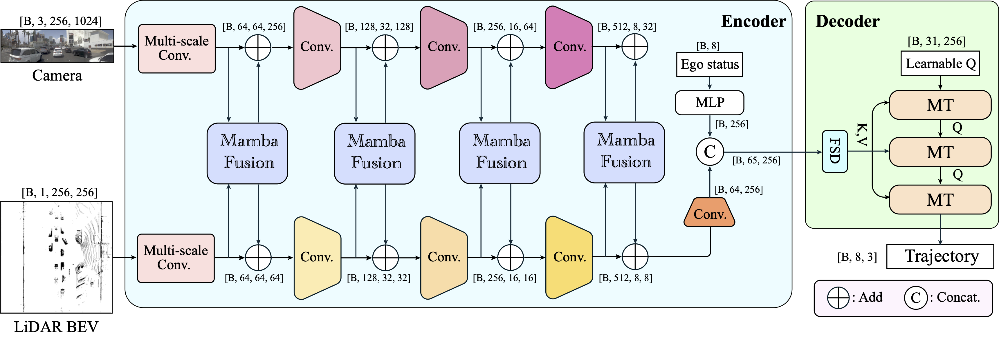

# DRAMA

**[[Paper](https://arxiv.org/pdf/2408.03601)] [[arXiv](https://arxiv.org/abs/2408.03601)] [[Project Page](https://chengran-yuan.github.io/DRAMA/)] [[Code](https://github.com/Chengran-Yuan/DRAMA)]**

_Chengran Yuan, Zhanqi Zhang, Jiawei Sun, Shuo Sun, Zefan Huang, Christina Dao Wen Lee, Dongen Li, Yuhang Han, Anthony Wong, Keng Peng Tee, and Marcelo H. Ang Jr._

## Abstract
Motion planning is a challenging task to generate safe and feasible trajectories in highly dynamic and complex environments, forming a core capability for autonomous vehicles. In this paper, we propose DRAMA, the first Mamba-based end-to-end motion planner for autonomous vehicles. DRAMA fuses camera, LiDAR Bird's Eye View images in the feature space, as well as ego status information, to generate a series of future ego trajectories. Unlike traditional transformer-based methods with quadratic attention complexity for sequence length, DRAMA is able to achieve a less computationally intensive attention complexity, demonstrating potential to deal with increasingly complex scenarios. Leveraging our Mamba fusion module, DRAMA efficiently and effectively fuses the features of the camera and LiDAR modalities. In addition, we introduce a Mamba-Transformer decoder that enhances the overall planning performance. This module is universally adaptable to any Transformer-based model, especially for tasks with long sequence inputs. We further introduce a novel feature state dropout which improves the planner's robustness without increasing training and inference times. Extensive experimental results show that DRAMA achieves higher accuracy on the NAVSIM dataset compared to the baseline Transfuser, with fewer parameters and lower computational costs.

## Code (Coming soon)

## BibTeX

If you find our work interesting, please consider citing our paper:

     @misc{yuan2024drama,
          title={DRAMA: An Efficient End-to-end Motion Planner for Autonomous Driving with Mamba}, 
          author={Chengran Yuan and Zhanqi Zhang and Jiawei Sun and Shuo Sun and Zefan Huang and Christina Dao Wen Lee and Dongen Li and Yuhang Han and Anthony Wong and Keng Peng Tee and Marcelo H. Ang Jr au2},
          year={2024},
          eprint={2408.03601},
          archivePrefix={arXiv},
          primaryClass={cs.RO},
          url={https://arxiv.org/abs/2408.03601}, 
    }

## License

This repository is licensed under the [Apache License 2.0](https://github.com/SS47816/DriveSceneGen/blob/main/LICENSE)

<small>
Project based on <a target="_blank" href="https://github.com/nestauk/ds-cookiecutter">Nesta's data science project template</a>
