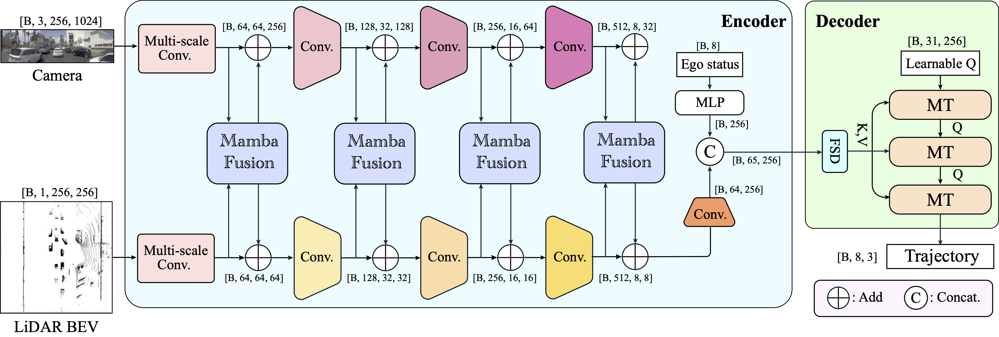

# DRAMA

**[[Paper](https://arxiv.org/pdf/2408.03601)] [[arXiv](https://arxiv.org/abs/2408.03601)] [[Project Page](https://chengran-yuan.github.io/DRAMA/)] [[Code](https://github.com/Chengran-Yuan/DRAMA)]**

_Chengran Yuan, Zhanqi Zhang, Jiawei Sun, Shuo Sun, Zefan Huang, Christina Dao Wen Lee, Dongen Li, Yuhang Han, Anthony Wong, Keng Peng Tee, and Marcelo H. Ang Jr._




## Code

**Attention⚠️**: We apologize for the typo in the previous citation we provided. **If you cited this work before June 13, 2025, please kindly update your citation.** Appreciate it!

### Env setting
```bash
pip install torch==2.1.0 torchvision==0.16.0 torchaudio==2.1.0 --index-url https://download.pytorch.org/whl/cu121

## install mamba 2
pip install https://github.com/state-spaces/mamba/releases/download/v2.2.4/mamba_ssm-2.2.4+cu12torch2.1cxx11abiFALSE-cp39-cp39-linux_x86_64.whl
```
## Training & Testing
Kindly find the scripts in `scripts/training/run_drama_training.sh` and `scripts/evaluation/run_drama_pdms.sh`

## BibTeX (updated)


     @article{yuan2024drama,
       title={Drama: An efficient end-to-end motion planner for autonomous driving with mamba},
       author={Yuan, Chengran and Zhang, Zhanqi and Sun, Jiawei and Sun, Shuo and Huang, Zefan and Lee, Christina Dao Wen and Li, Dongen and Han, Yuhang and Wong, Anthony and Tee, Keng Peng and others},
       journal={arXiv preprint arXiv:2408.03601},
       year={2024}
     }

## License

This repository is licensed under the [Apache License 2.0](https://github.com/SS47816/DriveSceneGen/blob/main/LICENSE)

<small><p>Project based on <a target="_blank" href="https://github.com/nestauk/ds-cookiecutter">Nesta's data science project template</a>
